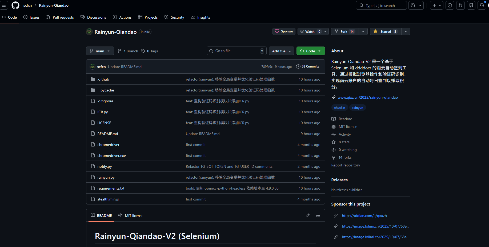
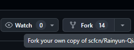
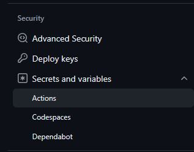

# 从此解放双手 ——雨云自动签到-V2

## 介绍

[Rainyun-Qiandao-V2](https://github.com/scfcn/Rainyun-Qiandao "Rainyun-Qiandao-V2") 是一个基于 Selenium 和 ddddocr 的雨云自动签到工具，通过模拟浏览器操作和验证码识别，实现雨云账户的自动每日签到以赚取积分。简单说就是帮你自动完成雨云账户的每日签到，还能自动处理验证码，不用你手动操作。

## 这个工具能做什么？

- 自动完成雨云账户的登录，不用自己输账号密码
- 能自动识别签到的验证码，用的是旋转分析加模板匹配的方式，识别率还不错
- 支持自定义随机延时，避免被系统当成自动化脚本，这个细节很贴心
- 不管是本地运行还是用 GitHub Actions 自动跑都可以
- 还支持多账户签到，我有两个雨云账户，用这个工具一次就能搞定两个的签到
- 签到结果还能通过多种方式通知你，比如微信、邮件、钉钉这些，不用担心不知道签到成功没
- 签到失败后也会通过GitHub绑定的邮箱进行通知

# 部署方式

## 一、GitHub actions部署

- 1.先转到[Rainyun-Qiandao](https://github.com/scfcn/Rainyun-Qiandao "Rainyun-Qiandao")这个项目



- 2.点击 右上角的 Fork



- 3.进入→仓库→设置


- 4.转到 Security 一栏，选择 Secrets and variables ，再选择 Actions



- 5.点击 New repository secret


- 6.新建 两个仓库秘密

```Plain Text

RAINYUN_USER = 你的雨云用户名
RAINYUN_PASS = 你的雨云密码
```

- 多用户的话分行写

- 7.转到 Actions


- 8.启用 Actions

- 9.手动运行一次 Actions ，没有异常就结束啦

**最后，补充几点点**
- 如果需要添加通知可以看看 [官方](https://github.com/scfcn/Rainyun-Qiandao/blob/main/README.md "官方")  的说明

- 为什么要添加 仓库秘密 ？因为直接明文标注信息，风险太大

- 为什么要 公开仓库 ？因为这样才不会消耗 Actions

## 二、本地部署

### 环境准备

首先得有 Python 3.9 以上的版本，还有 Google Chrome 浏览器，这个是基础要求。

### 克隆项目

先把项目克隆到本地，用 git 命令就行【自己开加速】：

```Plain Text

git clone https://github.com/scfcn/Rainyun-Qiandao.git
cd Rainyun-Qiandao
```

### 安装依赖

然后安装需要的依赖包，先升级 pip，再安装 requirements 里的依赖：

```Plain Text

python -m pip install --upgrade pip
pip install -r requirements.txt
```

这里我之前安装的时候遇到过依赖冲突的问题，后来用`pip install --upgrade pip setuptools wheel`先升级一下工具，再装依赖就没问题了。

### 配置和运行

配置的话有两种方法，我个人推荐用.env 文件的方式，比较方便管理。
创建一个.env 文件，内容可以这样写：

```Plain Text

RAINYUN_USER = 你的雨云用户名
RAINYUN_PASS = 你的雨云密码
DEBUG = false
HEADLESS = false
```

如果是多账户的话，用户名和密码可以换行写，比如：

```Plain Text

RAINYUN_USER = user1
user2
RAINYUN_PASS = pass1
pass2
```

然后直接运行脚本就行：

```Plain Text

python rainyun.py
```

如果不想用.env 文件，也可以用环境变量的方式配置，Windows 用 PowerShell 的话就是：

```Plain Text

$env:RAINYUN_USER = "你的用户名"
$env:RAINYUN_PASS = "你的密码"
python rainyun.py
```

Linux 或者 macOS 的话用 export 命令：

```Plain Text

export RAINYUN_USER="你的用户名"
export RAINYUN_PASS="你的密码"
python rainyun.py
```

## 感受

- 用了快一个月了，整体感觉很稳定，偶尔会遇到验证码识别失败的情况，不过脚本会自动重试，都能成功签到。
- 多账户的功能对我来说太实用了，不用分别登录两个账户签到。
- 通知功能也很好，每天能收到签到结果的通知，不用担心漏签。
- 项目的更新也很及时，最近还更新了 ICR 验证码识别模块，识别率比之前更高了。

## 一些小问题的解决

我使用过程中遇到过的问题：

- 仓库秘密 无法添加，可能是加速器的问题，退掉所有加速器，换用 [Fast GitHub](https://github.com/creazyboyone/FastGithub/releases "Fast GitHub") 即可

## 总结

这个项目，帮我们解决了手动签到的麻烦，免费、而且是开源的，用起来也放心

如果你也在每天手动签到雨云，不妨试试这个工具，能省不少事。

如果你有什么看法、意见或者是需要补充的，不妨在下方评论区聊聊