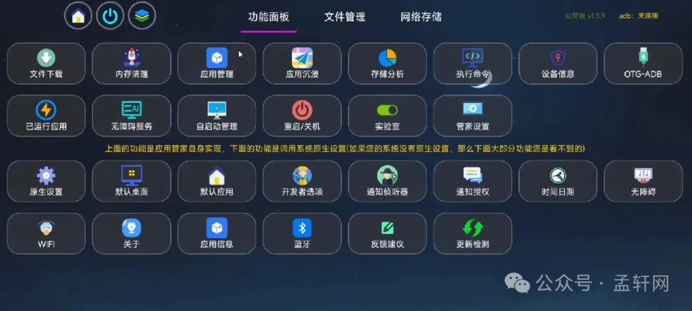
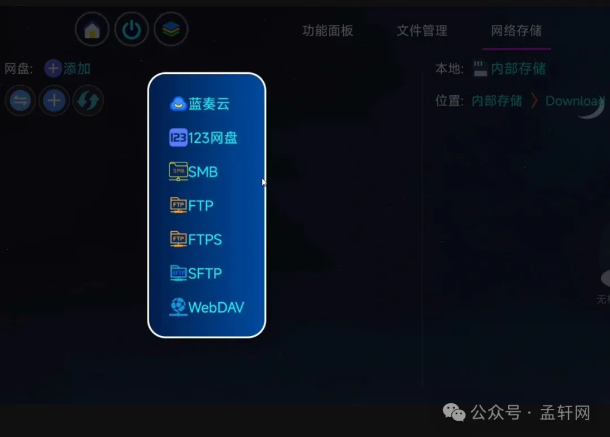
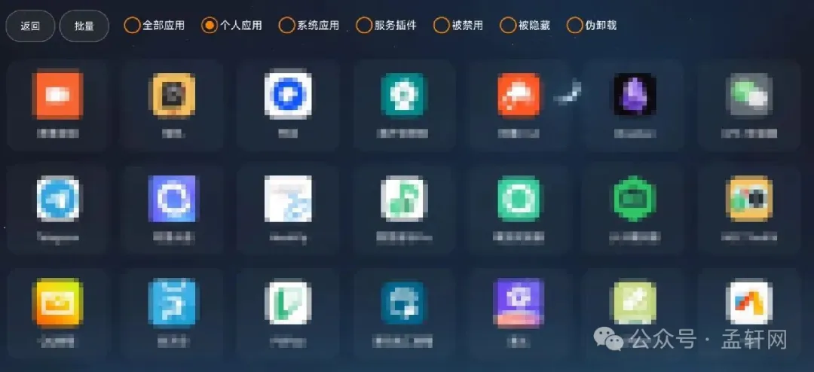

### 声明

本文为**我方**公众号转载！看清楚，公众号是**我的**！

### 一、应用介绍：

- 应用管家TV版是一款电视应用管理软件，软件为用户提供丰富的应用管理功能，包括清理缓存、卸载应用，并支持各种应用的一键共享，帮助用户一键管理多个应用程序，支持 adb/root 卸载系统软件，软件支持访问蓝奏云盘，方便快捷的访问自己下载的文件。

- 官方下载链接：[https://www.123pan.com/s/k7plVv-kxHtv.html](https://www.123pan.com/s/k7plVv-kxHtv.html "https://www.123pan.com/s/k7plVv-kxHtv.html")

### 二、应用管家TV版app功能：
- 1、进入后直接就可以浏览获取到全面的本地文件了
- 2、点击文件管理，就可以查询自己的相关文件以及删除操作
- 3、还可以在其他功能里查看到更多实用的服务
- 4、点击管家设置，可以修改相关设置

### 三、app特色：
- 1、支持管理电视上应用的卸载、禁用、清理缓存数据等功能；
- 2、支持提取已安装应用的安装包，无需额外安装apk提取等软件；
- 3、可快捷访问本地、TF/SD卡或U盘文件的管理，支持自主新建文件/文件夹、删除、复制、剪切、显示方式等文件内容；
- 4、局域网文件互传功能：前提手机和电视需保证在同一WIFI之下，手机扫码之后，可以将手机上下载的APP传送到电视进行安装；也能传送其他文件到电视；
- 5、蓝奏盘功能：可登录自己的蓝盘，然后直接下载已保存的APP文件进行安装；另可输入网盘链接直接下载文件。

### 四、app亮点
- 1、自定义备份目录。
- 2、让您轻松了解应用程序的详细信息。
- 3、允许您轻松地与朋友分享应用程序。
- 4、帮助您更快地找到需要管理的应用程序。
- 5、它具有单次卸载和批量卸载功能，并且root用户也可以使用静默卸载。

### 官方下载链接：[https://www.123pan.com/s/k7plVv-kxHtv.html](https://www.123pan.com/s/k7plVv-kxHtv.html "https://www.123pan.com/s/k7plVv-kxHtv.html")