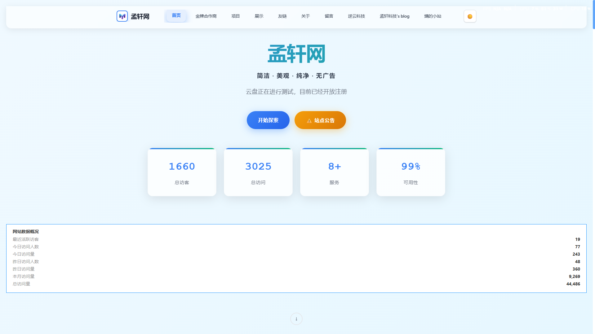
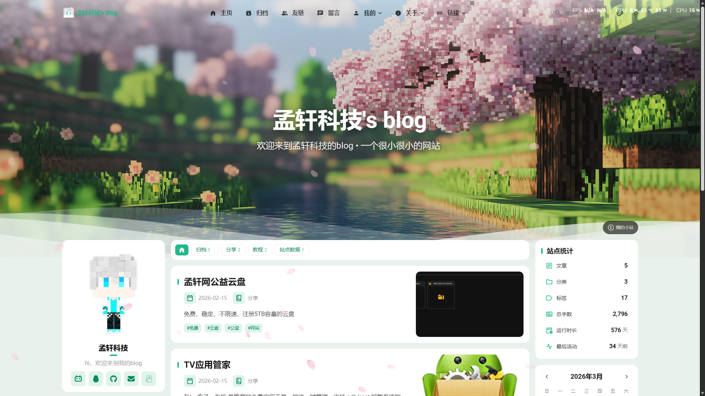

# 网站更换域名公告

## 前言

由于域名到期，导致部分服务出现问题

## 域名到期了

有些可能发现了，评论区和AI都出现了问题，这是因为网站之前的域名 `www.mxw315.buzz` 已经到期了

这次到期由于有新域名 `www.mxw2024.top` 了，所以就干脆不续了，很抱歉给您带来不便

## 新的开始

现在网站已经全面切换到新域名 **mxw2024.top** 了。

评论区之前短暂离线了一段时间，现在已经恢复正常了。之前在旧域名下留言的朋友不用担心，数据都在的。

## 一些碎碎念

说实话做网站运行这么久，域名换了也有几次了。每次换域名都有点像重新开始的感觉，URL变了，搜索引擎的索引也要重新积累，友链也要重新跟人家换...

不过也没办法，有些东西就是这样的。

## 后续

暂时没打算做什么大改动，主要就是维护着让网站正常跑着。如果以后有机会，可能会考虑加一些新功能，但也不一定，看心情吧。

## 最后

感谢各位一直以来的支持！

有什么问题可以在评论区留言，虽然可能回复不太及时，但看到了都会回的。
